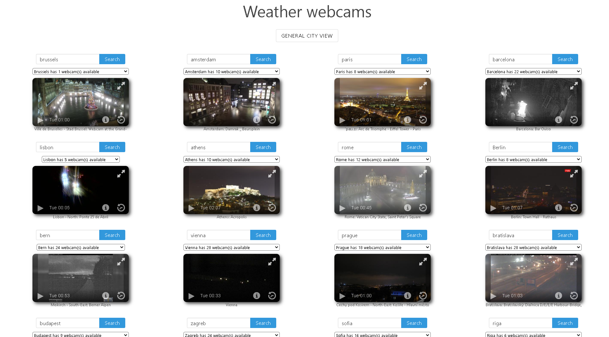

Website using [Windy API](https://api.windy.com/) to offer a clear weather overview of a particular european city of choice, and a costomizable page to compare the weather between different european cities at the same time. 

Done by [Jean Fabry](https://github.com/JeanFabry). 

Feel free to have a look at the [preview](https://jeanfabry.github.io/Meteo-webcams/).  

